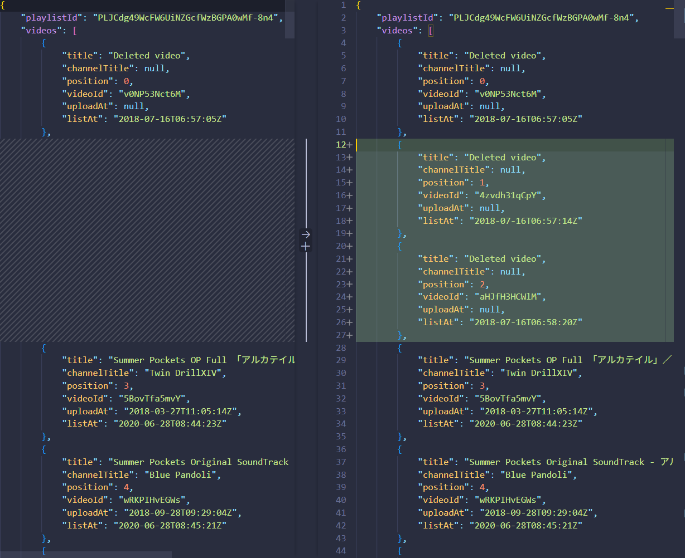

# YouTube Playlist Snapshot
Create snapshots of your youtube playlists to easily find any missing videos.
 
## How to use

### Prepare YouTube api key and playlists
Put your YouTube api key (you can get one for free at https://console.developers.google.com/) in `data/key.json`, and place the ID of your desired playlist in `data/list.json`. For convenience, assign an alias to your playlist using the `title` field.

### Run
To take snapshots of all playlists in `list.json`, run `python main.py -b`. To take a snapshot of a specific playlist, run `python main.py -o playlist_alias`, where `playlist_alias` is the alias defined in the `title` field of `list.json`, ex. `python main.py -o RO`.

Snapshots are `.json` files that save the names and the channel titles of all the videos in your playlist.

### Compare
By using Git to track changes, you can easily identify the differences before and after modifications to the playlist.

